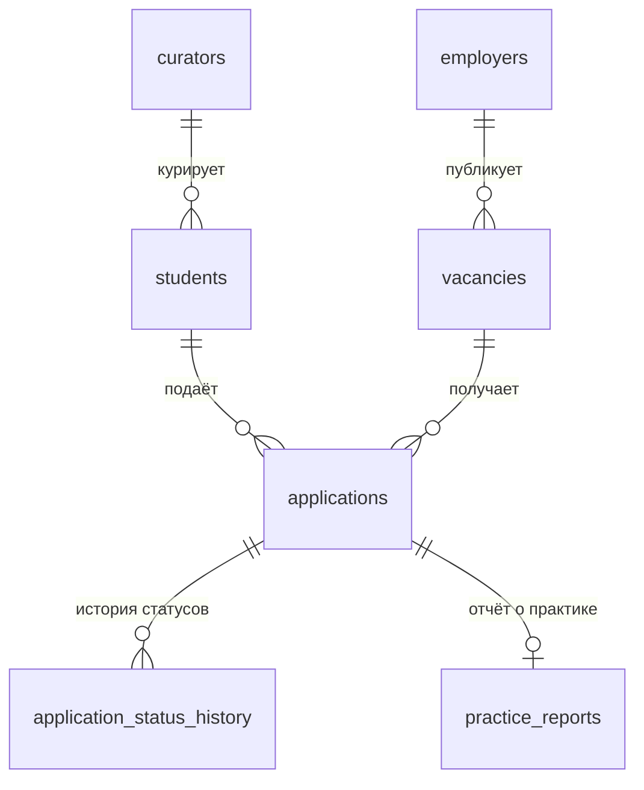

# «Практика»

Система приёма и маршрутизации заявок студентов на практику и вакансий от работодателей-партнёров
карьерного центра университета. Сквозной проект курса «Управление IT-проектами» (осень 2026).

[](../../actions/workflows/ci.yml)

| | |
|---|---|
| Заказчик | Методист карьерного центра (спонсор — руководитель центра) |
| Команда | Бекмағанбет Әлібек — PM, разработка · Зият Нүркен — аналитика, тестирование, CI |
| Модель поставки | Hybrid: вехи по неделям курса, внутри — итерации с демо раз в 2–3 недели ([ADR-001](docs/adr/0001-delivery-model.md)) |
| Стек | Python 3.11+, FastAPI, SQLite (MVP) → PostgreSQL ([ADR-002](docs/adr/0002-open-source-stack.md), [ADR-003](docs/adr/0003-database.md)) |
| Доска | GitHub Projects: _вставить ссылку после создания_ |

## Что внутри

```
app/            REST API: студенты, работодатели, вакансии, заявки, сроки отчётов
db/schema.sql   схема БД (SQLite); db/schema.postgres.sql — для продакшна
db/seed/        демо-база: 40 студентов, 10 партнёров, 24 вакансии, 36 заявок (все данные вымышлены)
db/market/      реальные вакансии PM с hh.kz из ЛЗ 1 и частотная таблица требований
finance/        TCO/ROI-модель ЛЗ 3: tco_model.xlsx (формулы) + tco_model.py (тот же расчёт в коде)
docs/           ADR, бизнес-кейс и устав (ЛЗ 3), требования (ЛЗ 4), модель данных, файлы лабораторных
docs/requirements/  бэклог stories.yaml, НФТ nfr.yaml, story map, матрица стейкхолдеров, протоколы интервью
scripts/        инициализация БД, демо-данные, сборка документов ЛЗ 3–4, story map, задачи и настройка GitHub
tests/          pytest: API, жизненный цикл заявки, финмодель, бэклог и НФТ
```

## Быстрый старт

```bash
python -m venv .venv
source .venv/bin/activate          # Windows: .venv\Scripts\activate
pip install -r requirements-dev.txt
python scripts/init_db.py          # data/praktika.db с демо-данными
uvicorn app.main:app --reload      # http://127.0.0.1:8000/docs
pytest
```

## База данных



Подробно — [docs/data-model.md](docs/data-model.md). Жизненный цикл заявки:
`submitted → forwarded → interview → accepted`, из любого незавершённого статуса — `rejected` или `withdrawn`.
Каждый переход пишется в `application_status_history` — отсюда метрика «доля заявок с прослеживаемым статусом».

## Основные эндпоинты

| Метод | Путь | Что делает |
|---|---|---|
| GET/POST | `/students` | база студентов (POST требует согласия на обработку ПДн) |
| GET | `/students/{id}/matches` | открытые вакансии, отсортированные по совпадению навыков |
| GET/POST | `/vacancies` | база вакансий, фильтры `kind`, `city`, `skill` |
| POST | `/applications` | подать заявку (проверка дедлайна и дублей) |
| PATCH | `/applications/{id}/status` | сменить статус (только допустимые переходы) |
| GET | `/reports/overdue` | просроченные отчёты о практике |
| GET | `/stats` | метрики из бизнес-кейса |

## Артефакты курса

| Неделя | Артефакт | Где |
|---|---|---|
| 1 | Карта компетенций, разбор провала, карточка проекта | [docs/labs/](docs/labs/), [docs/project-card.md](docs/project-card.md) |
| 2 | Сравнение моделей поставки, ADR-001, рабочее пространство | [docs/adr/0001-delivery-model.md](docs/adr/0001-delivery-model.md) |
| 3 | Бизнес-кейс, TCO/ROI-модель, устав | [docs/lz3-business-case.md](docs/lz3-business-case.md), [finance/](finance/) |
| 4 | Стейкхолдеры, коммуникации, интервью, story map, бэклог (20 историй), 18 НФТ | [docs/lz4-requirements.md](docs/lz4-requirements.md), [docs/requirements/](docs/requirements/) |

Полный чек-лист портфолио до недели 15 — [docs/portfolio-checklist.md](docs/portfolio-checklist.md).

## Настройка на GitHub (один раз)

1. Создать пустой репозиторий `praktika-project` на GitHub, добавить второго участника в collaborators.
2. `git remote add origin https://github.com/<логин>/praktika-project.git && git push -u origin main`
3. `bash scripts/setup_github.sh` — метки типов задач, приоритетов, `зс-1…15` и защита `main` (нужен `gh`).
4. Projects → New project → Board: статусы `Backlog, Ready, In Progress, In Review, Done`; поля
   Priority, Iteration (неделя ЗС), Estimate (Story Points), Role. Привязать к репозиторию.
5. `python scripts/create_issues.py` — эпики и 20 историй из бэклога в Issues; затем добавить их на доску.
6. Settings → Features → включить Wiki и Discussions (по желанию); вставить ссылку на доску в таблицу выше.

## Персональные данные

В репозитории нет реальных данных студентов: `db/seed/` сгенерирован скриптом `scripts/generate_demo_data.py`,
все e-mail — на `example.org`/`example.com`. Реальная база (`data/*.db`) исключена в `.gitignore`.

## Использование AI

Черновики кода и документов подготовлены с помощью AI-ассистента Claude (Anthropic) — см. раздел в
[docs/lz3-business-case.md](docs/lz3-business-case.md). Команда проверяет факты и несёт ответственность за содержание.
