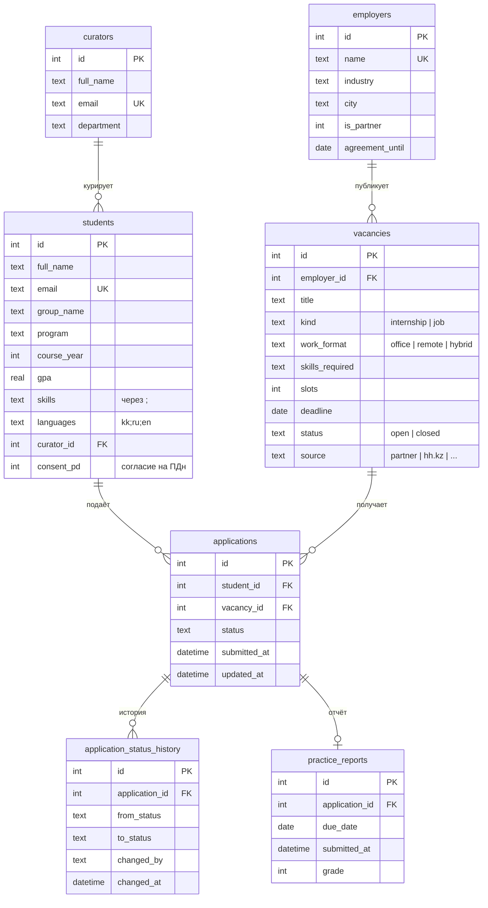

# Модель данных

Схема: [db/schema.sql](../db/schema.sql) (SQLite, MVP), [db/schema.postgres.sql](../db/schema.postgres.sql) (продакшн).

## Правила

- Один студент — одна заявка на вакансию (`UNIQUE (student_id, vacancy_id)`).
- Заявку нельзя подать после `deadline` или на закрытую вакансию.
- Переходы статусов: см. `app/domain.py` (`TRANSITIONS`). Финальные: `accepted`, `rejected`, `withdrawn`.
- Студент без согласия на обработку ПДн (`consent_pd = 0`) не создаётся.

## Наборы данных

| Файл | Что | Происхождение |
|---|---|---|
| `db/seed/*.csv` | демо-база студентов, партнёров, вакансий, заявок | синтетика, `scripts/generate_demo_data.py` |
| `db/market/hh_pm_vacancies_2026-09-10.csv` | 10 вакансий PM-ролей в Казахстане | hh.kz, выборка ЛЗ 1 |
| `db/market/pm_requirements_frequency.csv` | частотная таблица требований | ЛЗ 1, часть 2 |
