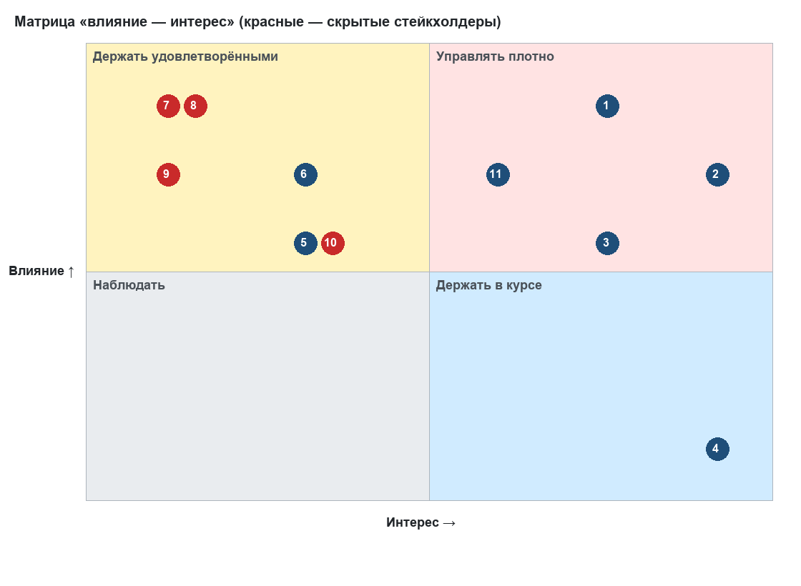
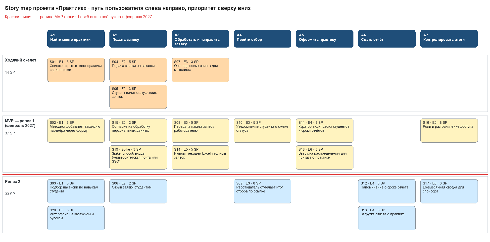

# ЛЗ 4. Стейкхолдеры, требования и product discovery проекта «Практика»

_Управление IT-проектами · Неделя 4 · 4 курс бакалавриата · осень 2026_

Артефакты ЗС 4: матрица стейкхолдеров и план коммуникаций (части 1–2), сценарии и протоколы двух интервью (часть 3), story map с выделенным MVP (часть 4), бэклог из 20 историй в трекере (часть 5), спецификация 18 нефункциональных требований (часть 6), порядок управления изменениями (часть 7). Исходники лежат в репозитории, в docs/requirements/. Бэклог и НФТ хранятся в YAML и проверяются тестами в CI, так что критерии приёмки ЗС 4 не «разъедутся» при правках.

## Часть 1. Стейкхолдеры: матрица «влияние — интерес»

Влияние и интерес — предварительная оценка по шкале 1–5; пересматриваем после интервью. Отдельно выделены скрытые стейкхолдеры — те, кого нет в карточке проекта, но кто может остановить запуск: ИТ-отдел, ответственный за ПДн, служба ИБ, учебный отдел. Отдел закупок в проект не входит: по бизнес-кейсу ЛЗ 3 ничего не покупаем. Если спонсор выберет Битрикс24 (вариант В1), закупки появятся в матрице.

| № | Стейкхолдер | Роль | Влияние | Интерес | Стратегия | Ожидания / опасения |
|---|---|---|---|---|---|---|
| 1 | Руководитель карьерного центра | Спонсор | 5 | 4 | Управлять плотно | Показатели трудоустройства, меньше жалоб; опасается, что система умрёт после ухода команды |
| 2 | Методист карьерного центра | Заказчик, владелец продукта | 4 | 5 | Управлять плотно | Меньше ручной работы; опасается двойной работы (Excel + система) на переходе |
| 3 | Кураторы практики на кафедрах | Пользователи | 3 | 4 | Управлять плотно | Видеть сроки отчётов; не хотят ещё одну систему с паролем |
| 4 | Студенты 3–4 курса | Основные пользователи | 1 | 5 | Держать в курсе | Прозрачный статус, быстрый ответ; опасаются, что заявка потеряется |
| 5 | HR работодателей-партнёров | Внешние пользователи | 3 | 2 | Держать удовлетворёнными | Готовый список кандидатов; не будут регистрироваться ради вуза |
| 6 | Заведующие кафедрами | Утверждают кураторов и приказы | 4 | 2 | Держать удовлетворёнными | Отчётность по практике без лишних усилий |
| 7 | ИТ-отдел университета (скрытый) | Сервер, поддержка после запуска | 5 | 1 | Держать удовлетворёнными | Не получить неподдерживаемую систему; может заблокировать запуск |
| 8 | Ответственный за защиту ПДн / юрист (скрытый) | Согласия, сроки хранения, локализация | 5 | 1 | Держать удовлетворёнными | Соответствие закону о ПДн; право вето на запуск |
| 9 | Служба информационной безопасности (скрытый) | Требования к доступу и логам | 4 | 1 | Держать удовлетворёнными | HTTPS, роли, журналирование; проверка перед публикацией в интернет |
| 10 | Учебный отдел (офис регистратора) (скрытый) | Приказы о практике | 3 | 2 | Держать удовлетворёнными | Выгрузка в своём формате; не хочет менять процедуру приказа |
| 11 | Преподаватель курса | Оценивает артефакты команды | 4 | 3 | Управлять плотно | Артефакты по неделям, честные данные |

_Рис. 1. Матрица стейкхолдеров (номера — по таблице; красные — скрытые)_

Вывод: в квадрате «держать удовлетворёнными» сидят три скрытых стейкхолдера с правом вето (ИТ-отдел, ПДн, ИБ) и нулевым интересом. Именно они чаще всего срывают запуск внутренних систем вуза в последний момент. Поэтому их требования вошли в НФТ сразу (NFR-04…NFR-11, NFR-17), а встречи с ними стоят в плане коммуникаций до недели 5, а не перед запуском.

## Часть 2. План коммуникаций

| Кому | Что | Как часто | Канал | Владелец |
|---|---|---|---|---|
| Спонсор | Статус вех, риски, решения на уровне спонсора (go / no-go из ЛЗ 3) | Раз в месяц + при эскалации (ответ за 2 рабочих дня) | Письмо-отчёт на 1 страницу + встреча 15 мин | Бекмағанбет Әлібек (PM) |
| Методист (заказчик) | Демо инкремента, уточнение и приоритеты бэклога | Раз в 2–3 недели (ADR-001); вопросы — по мере появления | Очная встреча 30 мин; Telegram для вопросов | Бекмағанбет Әлібек |
| Кураторы кафедр | Что меняется для них; сбор замечаний к сценарию «сроки отчётов» | Нед. 5 и нед. 11 (UAT) | Рассылка через методиста + опрос Google Forms | Зият Нүркен (аналитик) |
| Студенты | Интервью, тест прототипа, UAT | Нед. 4 (интервью), нед. 8 (прототип), нед. 11 (UAT) | Лично; Google Forms | Зият Нүркен |
| HR работодателей-партнёров | Новый порядок передачи кандидатов; тест ссылки отбора | Январь 2027, перед запуском | Письмо от имени карьерного центра | Бекмағанбет Әлібек через методиста |
| ИТ-отдел | Требования к серверу, поддержка ≤ 4 ч/мес (go / no-go №2), runbook | Нед. 5, нед. 10 (развёртывание), передача в феврале 2027 | Служебная записка + встреча | Бекмағанбет Әлібек |
| Ответственный за ПДн / юрист | Текст согласия, сроки хранения (NFR-11), локализация (NFR-10) | Нед. 5 и перед запуском | Служебная записка | Зият Нүркен |
| Служба ИБ | HTTPS, роли, логи (NFR-05…NFR-09) | Нед. 7 (модель угроз), перед запуском | Встреча + чек-лист | Зият Нүркен |
| Учебный отдел | Формат выгрузки для приказа (S18) | Нед. 5 | Встреча 15 мин с образцом приказа | Зият Нүркен |
| Преподаватель курса | Артефакты ЗС | Еженедельно | Репозиторий + LMS | Вся команда |
| Команда | Синхронизация, блокеры | 2 раза в неделю по 15 мин | Telegram + доска GitHub Projects | Бекмағанбет Әлібек |

## Часть 3. Интервью с представителями пользователей

> Интервью проводит команда — результаты ниже не заполнены намеренно. Критерий рубрики «ничего не выдумано»: протоколы заполняются только по факту разговора.

План: 2 проблемных интервью по 30–40 минут до 01.10.2026. Кого берём: (1) методист карьерного центра — главный носитель процесса; (2) студент 4 курса, который в прошлом семестре искал практику через центр. Если успеваем — третье интервью с куратором кафедры.

### 3.1. Что проверяем (гипотезы из ЛЗ 3)

| Гипотеза | Откуда | Чем подтвердится / опровергнется |
|---|---|---|
| Методист тратит ≥ 3 ч/нед на сведение заявок | Допущение A3, go / no-go №1 | Рассказ о последней неделе по шагам + самозамер 2 недели |
| Заявки теряются ≈ 8 раз в год | Допущение A16 | Конкретные случаи за прошлый семестр: сколько, как обнаружили |
| Студент не знает статус и пишет методисту | Карточка проекта | Сколько раз студент спрашивал статус, через какой канал, сколько ждал ответ |
| Кураторы узнают о просроченных отчётах поздно | Допущение A5 | Последний случай просрочки: когда узнали |

### 3.2. Как не задавать наводящих вопросов

- Спрашиваем о прошлом поведении, а не о мнении о будущем: «Расскажите, как было в последний раз, когда…», а не «Вам было бы удобно, если бы…».
- Не показываем решение до конца интервью и не произносим слово «система».
- Просим цифры из жизни: «Сколько заявок пришло на прошлой неделе? Где они сейчас?».
- Молчим после ответа 3–5 секунд — человек обычно добавляет самое важное.
- Записываем дословные цитаты и отдельно — наши интерпретации.

### 3.3. Сценарий интервью с методистом

1. Расскажите, как выглядел ваш последний понедельник в период приёма заявок — с момента, когда вы открыли почту.
2. Откуда приходят заявки студентов и предложения работодателей? Покажите, где они лежат сейчас.
3. Сколько времени заняло сведение заявок на прошлой неделе? Как вы это поняли?
4. Вспомните последний случай, когда заявка потерялась. Как это обнаружилось? Что вы сделали?
5. Кто ещё просит у вас данные о практике (кафедры, учебный отдел, руководитель)? В каком виде?
6. Что вы уже пробовали, чтобы упростить работу? Почему не прижилось?
7. Что обязательно должно остаться как сейчас?
8. Кого ещё нам стоит расспросить?

### 3.4. Сценарий интервью со студентом

1. Расскажите, как вы искали место практики в прошлый раз — с чего начали?
2. Как вы подавали заявку? Сколько заявок подали, на какие места?
3. Как вы узнавали, что происходит с заявкой? Сколько ждали ответа?
4. Был ли момент, когда вы не понимали, что делать дальше? Что сделали?
5. Как вы узнали срок сдачи отчёта о практике? Сдали вовремя?
6. С какого устройства и на каком языке вам удобнее такими вещами заниматься?

### 3.5. Протоколы (заполнить после интервью)

| Поле | Интервью 1 — методист | Интервью 2 — студент |
|---|---|---|
| Дата, длительность, кто проводил |  |  |
| Респондент (роль, без ФИО в репозитории) |  |  |
| Ключевые факты с цифрами |  |  |
| Дословные цитаты (2–3) |  |  |
| Что подтвердилось / опровергнуто из 3.1 |  |  |
| Новые требования → ID истории / НФТ |  |  |
| Что меняем в бэклоге |  |  |

Шаблон протокола для репозитория: docs/requirements/interviews/protocol-template.md. Имена респондентов в публичный репозиторий не кладём (NFR-10) — только роль.

## Часть 4. Jobs-to-be-Done и story map

### 4.1. Работы, которые «нанимают» систему

| Кто | Когда… | Хочу… | Чтобы… |
|---|---|---|---|
| Студент | мне нужно место практики к сроку кафедры | быстро найти подходящие места и подать заявку | не остаться без практики и не бегать за методистом |
| Методист | в сентябре приходят десятки заявок в день | видеть все заявки в одном месте со статусом | ни одна не потерялась, а я не тратил вечер на Excel |
| Куратор | приближается срок отчётов | знать, кто из моих студентов не сдал | напомнить заранее, а не разбираться после срока |
| HR работодателя | университет присылает кандидатов | получить один понятный список и ответить в один клик | не вести переписку по каждому студенту |

> Персоны не делаем: пользователей 4 типа, их различия описываются работой, а не демографией — персоны здесь были бы «мусором», о котором предупреждает лекция 4.

### 4.2. Story map

_Рис. 2. Story map: сверху — путь пользователя, ниже — истории по релизам_

Ходячий скелет (14 SP): студент видит вакансию → подаёт заявку → методист видит её в очереди → студент видит статус. Это самый тонкий сквозной срез, на котором можно показать методисту работающий процесс уже на демо недели 8.

MVP / релиз 1 (51 SP вместе со скелетом) — то, без чего нельзя отказаться от Excel в феврале 2027: импорт текущей таблицы, передача заявок работодателю, уведомления, роли, согласие на ПДн, выгрузка для приказа. Загрузка отчётов и напоминания (шаг «Сдать отчёт») сознательно отложены в релиз 2: к февралю важнее распределение на практику, а отчёты сдаются только в конце семестра. Релиз 2 — 33 SP.

Редактируемая версия карты: docs/requirements/story-map.excalidraw (открыть на excalidraw.com → Open). Карта генерируется из stories.yaml, поэтому она и бэклог не расходятся.

## Часть 5. Бэклог в трекере

Истории заносятся в GitHub Issues скриптом scripts/create_issues.py: эпики создаются отдельными задачами, у истории есть метки типа, приоритета и релиза, оценка в Story Points и ссылка на эпик. Приоритет следует из релиза: скелет и MVP — High, релиз 2 — Medium. Истории проверены по INVEST: каждая даёт видимую пользователю ценность, оценена и укладывается в одну итерацию (≤ 8 SP); спайк S19 ограничен 4 часами.

| ID | История | Эпик | Релиз | SP |
|---|---|---|---|---|
| S01 | Список открытых мест практики с фильтрами | E1 Каталог вакансий | Ходячий скелет | 3 |
| S02 | Методист добавляет вакансию партнёра через форму | E1 Каталог вакансий | MVP (релиз 1) | 3 |
| S03 | Подбор вакансий по навыкам студента | E1 Каталог вакансий | Релиз 2 | 5 |
| S04 | Подача заявки на вакансию | E2 Подача заявки | Ходячий скелет | 5 |
| S05 | Студент видит статус своих заявок | E2 Подача заявки | Ходячий скелет | 3 |
| S06 | Отзыв заявки студентом | E2 Подача заявки | Релиз 2 | 2 |
| S07 | Очередь новых заявок для методиста | E3 Маршрутизация и статусы | Ходячий скелет | 3 |
| S08 | Передача пакета заявок работодателю | E3 Маршрутизация и статусы | MVP (релиз 1) | 5 |
| S09 | Работодатель отмечает итог отбора по ссылке | E3 Маршрутизация и статусы | Релиз 2 | 8 |
| S10 | Уведомление студента о смене статуса | E3 Маршрутизация и статусы | MVP (релиз 1) | 5 |
| S11 | Куратор видит своих студентов и сроки отчётов | E4 Практика и отчёты | MVP (релиз 1) | 3 |
| S12 | Напоминание о сроке отчёта | E4 Практика и отчёты | Релиз 2 | 5 |
| S13 | Загрузка отчёта о практике | E4 Практика и отчёты | Релиз 2 | 5 |
| S14 | Импорт текущей Excel-таблицы заявок | E5 Доступ, данные и соответствие | MVP (релиз 1) | 5 |
| S15 | Согласие на обработку персональных данных | E5 Доступ, данные и соответствие | MVP (релиз 1) | 2 |
| S16 | Роли и разграничение доступа | E5 Доступ, данные и соответствие | MVP (релиз 1) | 8 |
| S17 | Ежемесячная сводка для спонсора | E6 Аналитика | Релиз 2 | 3 |
| S18 | Выгрузка распределения для приказа о практике | E6 Аналитика | MVP (релиз 1) | 3 |
| S19 | Spike: способ входа (университетская почта или SSO) | E5 Доступ, данные и соответствие | MVP (релиз 1) | 3 |
| S20 | Интерфейс на казахском и русском | E5 Доступ, данные и соответствие | Релиз 2 | 5 |

Итого: 84 SP. Критерии приёмки в формате Given–When–Then — в приложении А.

## Часть 6. Спецификация нефункциональных требований

18 требований по чек-листу лекции 4. У каждого есть числовой порог и способ проверки: «система быстрая» не принимается. Требования, помеченные ✔, уже проверяются автотестами прототипа (tests/test_nfr.py) в CI.

| ID | Категория | Требование | Метрика / порог | Как проверяем | Когда | Источник |
|---|---|---|---|---|---|---|
| NFR-01 ✔ | Производительность | Чтение списков и карточек (вакансии, заявки) отвечает быстро в пиковую неделю. | p95 времени ответа API ≤ 800 мс при 50 одновременных пользователях; smoke — p95 ≤ 200 мс на 200 последовательных запросов к демо-базе | k6 на стенде (ЗС 11); smoke — pytest в CI | ЗС 10–11 | Методист (пик 30–40 заявок/нед), ADR-002 |
| NFR-02 | Масштабируемость | Объём данных за 3 года эксплуатации не ухудшает NFR-01. | 3 000 студентов, 600 вакансий, 6 000 заявок в базе — NFR-01 выполняется | генерация объёма скриптом + повтор k6 | ЗС 11 | Бизнес-кейс ЛЗ 3 (горизонт 3 года) |
| NFR-03 | Доступность (SLA) | Сервис доступен в рабочее время университета. | ≥ 99,0 % в месяц с 08:00 до 20:00 по времени Астаны; плановые работы — только вне этого окна | внешний мониторинг (Uptime Kuma), отчёт за месяц | с запуска | Спонсор, ИТ-отдел |
| NFR-04 | Резервное копирование | Потеря данных и время восстановления ограничены. | RPO ≤ 24 ч (ежесуточная копия на отдельный сервер); RTO ≤ 4 ч; тест восстановления раз в квартал | протокол тестового восстановления на копии (runbook, ЗС 11) | ЗС 11, далее ежеквартально | ИТ-отдел, бизнес-кейс (VPS под резервные копии) |
| NFR-05 | Безопасность передачи | Весь трафик зашифрован. | только HTTPS, TLS 1.2+, HSTS; HTTP-запросы перенаправляются на HTTPS; оценка SSL Labs не ниже A | SSL Labs + curl -I на стенде | ЗС 10 | Служба ИБ |
| NFR-06 | Разграничение доступа | Пользователь видит только данные своей роли. | 4 роли (студент, методист, куратор, администратор); 100 % эндпоинтов покрыты тестами «чужая роль → 403» | матрица «роль × эндпоинт» в pytest | ЗС 9 | Ответственный за ПДн, S16 |
| NFR-07 | Аутентификация | Система не становится местом утечки паролей. | вход через университетскую почту/SSO (спайк S19) либо пароли только в виде argon2-хэша; блокировка после 10 неудачных попыток за 15 минут | ревью кода + тест блокировки | ЗС 9 | Служба ИБ |
| NFR-08 ✔ | Аудит | Любое изменение статуса заявки и данных студента прослеживается. | 100 % изменений статуса записаны в журнал (кто, когда, было, стало); журнал хранится ≥ 3 лет и не редактируется через интерфейс | pytest — каждое изменение статуса даёт запись истории | уже есть в прототипе | Методист (метрика «прослеживаемый статус»), бизнес-кейс |
| NFR-09 | Журналирование | Логи помогают разбирать инциденты и не содержат лишних персональных данных. | структурированные JSON-логи; e-mail и телефон маскируются; хранение 90 дней | проверка образца логов на стенде | ЗС 10 | Служба ИБ, ответственный за ПДн |
| NFR-10 ✔ | Персональные данные | Обработка ПДн соответствует Закону РК «О персональных данных и их защите». | база с ПДн размещена на серверах в РК; 100 % профилей студентов созданы только после согласия с датой согласия | договор хостинга (hoster.kz, РК) + pytest «без согласия → 422» | уже есть в прототипе (согласие); хостинг — ЗС 10 | Юрист / ответственный за ПДн |
| NFR-11 | Сроки хранения ПДн | Данные не хранятся дольше, чем нужно. | профили выпускников обезличиваются через 3 года после выпуска (срок согласовать с юристом); задача обезличивания запускается раз в месяц | тест задачи обезличивания на демо-данных | релиз 2 | Юрист (допущение — подтвердить) |
| NFR-12 | Локализация | Интерфейс студента и методиста на казахском и русском. | 100 % строк интерфейса есть в обоих файлах переводов (kk, ru); английский — для писем работодателям | скрипт сравнения ключей переводов в CI | релиз 2 (S20) | Студенты, требования вуза к двуязычию |
| NFR-13 | Доступность для людей с ограничениями (accessibility) | Страницы студента пригодны для работы с клавиатуры и экранного диктора. | WCAG 2.1 уровень AA; Lighthouse Accessibility ≥ 90 на страницах студента | Lighthouse / axe в CI | ЗС 11 | Требования вуза к инклюзивности |
| NFR-14 | Совместимость | Система работает в браузерах пользователей, включая телефон. | 2 последние версии Chrome, Firefox, Safari, Edge; ширина экрана от 360 px без горизонтальной прокрутки | ручной чек-лист на UAT (ЗС 11) | ЗС 11 | Студенты (интервью) |
| NFR-15 | Интеграции и форматы обмена | Обмен данными с Excel без ручной перепечатки. | импорт .xlsx текущего формата центра — 1 000 строк ≤ 1 мин с отчётом об ошибках по номерам строк; экспорт для приказа — .xlsx и .csv UTF-8 | pytest на эталонном файле | MVP (S14, S18) | Методист, учебный отдел |
| NFR-16 | Миграция данных | Данные текущего семестра переносятся полностью. | 100 % заявок текущего семестра в системе; расхождение числа строк с исходной таблицей = 0; акт сверки подписан методистом | скрипт сверки + акт | январь 2027 | Методист, бизнес-кейс (статья «перенос данных») |
| NFR-17 | Эксплуатация | Систему может поддерживать ИТ-отдел без команды. | развёртывание с нуля по runbook ≤ 30 мин одной командой; обновление без потери данных; средняя поддержка ≤ 4 ч/мес | развёртывание сотрудником ИТ-отдела по runbook без помощи команды | ЗС 11, передача — февраль 2027 | ИТ-отдел, бизнес-кейс (допущение A10) |
| NFR-18 | Уведомления | Письма о смене статуса приходят быстро. | 99 % писем отправлены ≤ 5 мин после события; неудачная отправка повторяется до 3 раз и попадает в журнал | метрика очереди отправки на стенде | MVP (S10) | Студенты |

## Часть 7. Управление изменениями требований

- Базовая линия: состояние stories.yaml и nfr.yaml на конец недели 4 фиксируется git-тегом baseline-v1. Любое отличие от базы видно командой git diff baseline-v1 -- docs/requirements.
- Запрос на изменение: задача на GitHub по шаблону «Change Request» — что меняется, зачем, влияние на SP, сроки и бюджет.
- Кто решает: PM — если изменение укладывается в текущий релиз без сдвига вех (обмен историй равного объёма). Спонсор — если сдвигается веха, растёт бюджет больше 10 % или меняются границы скоупа (устав, ЛЗ 3).
- После решения: правка YAML в отдельной ветке + PR со ссылкой на Change Request; CI проверяет, что бэклог и НФТ по-прежнему соответствуют критериям.
- Раз в 2–3 недели на демо методисту показываем список принятых и отклонённых изменений.

## Приложение А. Критерии приёмки историй

### S01. Список открытых мест практики с фильтрами (3 SP)

Как студент, я хочу видеть открытые места практики с фильтром по городу и формату работы, чтобы выбрать подходящие, не листая переписку.

- Given есть открытые вакансии в Алматы и Астане, When студент выбирает фильтр «Астана», Then в списке только вакансии Астаны.
- Given у вакансии прошёл срок приёма заявок, When студент открывает список, Then этой вакансии в списке нет.

### S02. Методист добавляет вакансию партнёра через форму (3 SP)

Как методист, я хочу добавить вакансию партнёра через форму, чтобы не пересылать письма работодателей студентам вручную.

- Given методист заполнил обязательные поля, When нажимает «Опубликовать», Then вакансия видна студентам в течение минуты.
- Given не указан срок приёма заявок, When методист сохраняет форму, Then система показывает ошибку и не публикует вакансию.

### S03. Подбор вакансий по навыкам студента (5 SP)

Как студент, я хочу видеть вакансии, подходящие под мои навыки, чтобы не перебирать весь список.

- Given у студента навыки Python и SQL, When он открывает «Подходящие», Then вакансии с требованиями Python и SQL стоят выше остальных.
- Given совпадение навыков меньше 50 %, When студент открывает «Подходящие», Then такая вакансия не показывается.

### S04. Подача заявки на вакансию (5 SP)

Как студент, я хочу подать заявку на вакансию из карточки вакансии, чтобы не писать письмо методисту.

- Given вакансия открыта, When студент нажимает «Подать заявку», Then заявка создаётся со статусом «Подана» и появляется у методиста.
- Given студент уже подал заявку на эту вакансию, When он пытается подать ещё раз, Then система сообщает, что заявка уже есть.
- Given срок приёма заявок прошёл, When студент пытается подать заявку, Then кнопка недоступна.

### S05. Студент видит статус своих заявок (3 SP)

Как студент, я хочу видеть статус каждой своей заявки и дату последнего изменения, чтобы не спрашивать методиста.

- Given методист передал заявку работодателю, When студент открывает «Мои заявки», Then статус «Передана работодателю» и дата изменения.
- Given у студента нет заявок, When он открывает «Мои заявки», Then видит подсказку, как подать первую.

### S06. Отзыв заявки студентом (2 SP)

Как студент, я хочу отозвать заявку, пока по ней не принято решение, чтобы освободить место другим.

- Given заявка в статусе «Подана» или «Передана», When студент нажимает «Отозвать», Then статус «Отозвана», методист видит это в очереди.
- Given заявка в статусе «Принят(а)», When студент открывает заявку, Then кнопки «Отозвать» нет.

### S07. Очередь новых заявок для методиста (3 SP)

Как методист, я хочу видеть все новые заявки в одной очереди, отсортированной по сроку вакансии, чтобы ничего не терять.

- Given есть 10 новых заявок на разные вакансии, When методист открывает очередь, Then заявки отсортированы по сроку приёма вакансии, ближайший — сверху.
- Given заявка обработана, When методист меняет её статус, Then она исчезает из очереди новых.

### S08. Передача пакета заявок работодателю (5 SP)

Как методист, я хочу передать работодателю все заявки по его вакансии одним действием, чтобы не собирать письма вручную.

- Given по вакансии 5 заявок в статусе «Подана», When методист нажимает «Передать работодателю», Then работодатель получает одно письмо со списком, все 5 заявок — в статусе «Передана».
- Given у работодателя не указан e-mail, When методист пытается передать заявки, Then система просит заполнить контакт.

### S09. Работодатель отмечает итог отбора по ссылке (8 SP)

Как HR работодателя, я хочу отметить итог отбора по ссылке из письма без регистрации, чтобы методист сразу узнал результат.

- Given работодатель открыл ссылку из письма, When отмечает кандидата «Принят», Then статус заявки меняется на «Принят(а)» с автором «employer».
- Given ссылке больше 30 дней, When работодатель её открывает, Then видит сообщение, что ссылка устарела, и контакт методиста.

### S10. Уведомление студента о смене статуса (5 SP)

Как студент, я хочу получать письмо при смене статуса заявки, чтобы не проверять систему каждый день.

- Given статус заявки изменился, When прошло не более 5 минут, Then студент получил письмо с новым статусом и ссылкой на заявку.
- Given письмо не доставлено, When сервер почты вернул ошибку, Then событие записано в журнал и повторяется до 3 раз.

### S11. Куратор видит своих студентов и сроки отчётов (3 SP)

Как куратор, я хочу видеть список своих студентов с местом практики и сроком отчёта, чтобы не собирать эти данные у методиста.

- Given у куратора 12 студентов, из них 7 приняты на практику, When куратор открывает «Мои студенты», Then видит 12 строк, у 7 — место и срок отчёта.
- Given куратор открывает список, When у студента срок отчёта прошёл, Then строка выделена как просроченная.

### S12. Напоминание о сроке отчёта (5 SP)

Как куратор, я хочу, чтобы студенты без сданного отчёта получали напоминание за 7 дней до срока, чтобы меньше отчётов опаздывало.

- Given до срока отчёта 7 дней и отчёт не сдан, When срабатывает ежедневная задача, Then студент и куратор получают напоминание.
- Given отчёт уже сдан, When срабатывает задача, Then напоминание не отправляется.

### S13. Загрузка отчёта о практике (5 SP)

Как студент, я хочу загрузить отчёт о практике в систему, чтобы куратор видел факт и дату сдачи.

- Given студент принят на практику, When загружает PDF до 10 МБ, Then отчёт сохранён, дата сдачи видна куратору.
- Given файл не PDF или больше 10 МБ, When студент загружает его, Then система отклоняет файл с понятным сообщением.

### S14. Импорт текущей Excel-таблицы заявок (5 SP)

Как методист, я хочу импортировать текущую Excel-таблицу заявок, чтобы не вводить семестр заново.

- Given таблица в текущем формате центра на 300 строк, When методист загружает её, Then все корректные строки импортированы, а по ошибочным выдан отчёт с номерами строк.
- Given импорт выполнен, When методист сравнивает число строк, Then число заявок в системе равно числу корректных строк файла.

### S15. Согласие на обработку персональных данных (2 SP)

Как студент, я хочу дать согласие на обработку персональных данных при первом входе, чтобы понимать, какие данные и зачем хранятся.

- Given студент входит впервые, When не отмечает согласие, Then профиль не создаётся и заявку подать нельзя.
- Given студент дал согласие, When методист открывает профиль, Then видна дата согласия.

### S16. Роли и разграничение доступа (8 SP)

Как администратор ИТ-отдела, я хочу разграничить роли студент, методист, куратор и администратор, чтобы каждый видел только свои данные.

- Given пользователь с ролью «студент», When запрашивает заявку другого студента, Then получает отказ 403.
- Given пользователь с ролью «куратор», When открывает список студентов, Then видит только студентов своей кафедры.

### S17. Ежемесячная сводка для спонсора (3 SP)

Как руководитель карьерного центра, я хочу получать в начале месяца сводку по заявкам и отчётам, чтобы видеть эффект проекта без запросов команде.

- Given наступило 1-е число месяца, When срабатывает задача, Then спонсор получает письмо со статусами заявок, долей прослеживаемых заявок и числом просроченных отчётов.

### S18. Выгрузка распределения для приказа о практике (3 SP)

Как методист, я хочу выгрузить список принятых на практику студентов в Excel, чтобы подготовить приказ в учебном отделе.

- Given 40 студентов приняты на практику, When методист нажимает «Выгрузить для приказа», Then скачивается .xlsx с 40 строками ФИО, группа, организация, сроки, куратор.

### S19. Spike: способ входа (университетская почта или SSO) (3 SP)

Как команда, мы хотим за 4 часа выяснить, можно ли входить через университетскую почту или SSO, чтобы не хранить пароли у себя.

- Given спайк завершён, When команда открывает ADR, Then в нём выбран способ входа, отклонённые варианты и согласие ИТ-отдела.

### S20. Интерфейс на казахском и русском (5 SP)

Как студент, я хочу переключать интерфейс между казахским и русским, чтобы пользоваться системой на удобном языке.

- Given студент выбрал казахский, When открывает любую страницу студента, Then все подписи на казахском.
- Given в файле переводов нет ключа на одном из языков, When запускается CI, Then проверка падает.

## Раскрытие использования AI

По правилам курса: черновики сценариев интервью, историй, НФТ и скриптов подготовлены с помощью AI-ассистента Claude (Anthropic). Оценки влияния и интереса, Story Points и пороги НФТ — предложения, которые команда пересматривает по итогам интервью и согласует с заказчиком. Результаты интервью AI не генерировал: протоколы заполняет команда. Ответственность за содержание несёт команда.
